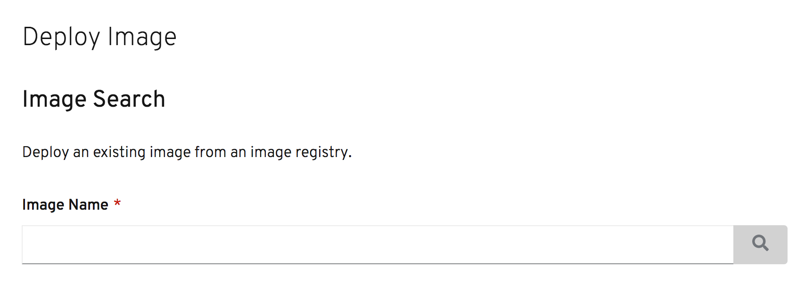

Before we get started, be sure that you are in the right project

```execute
oc project lab-intro-{{ username }}
```

Switch to the OpenShift [Web Console]({{ console_url }}) and select the **Developer** perspective for the project instead of the **Adminstrator** perspective in the left hand side menu. 

On the **Topology** view, select **Container Image**. This should present the option of deploying an image by performing a search for the image on an image registry.



For this example, the application image we are going to deploy is being hosted on the Docker Hub Registry.

In the **Image Name** field enter:

```copy
openshiftkatacoda/blog-django-py
```

Press **Enter**, or click on the magnifying glass to the right of the field. This should trigger a query to pull down the details of the image from the Docker Hub Registry, including information on when the image was last updated, the size of the image and the number of layers.


From the name of the image, the **Application Name** and deployment **Name** fields will be automatically populated.

The deployment name is used in OpenShift to identify the resources created when the application is deployed. This will include the internal **Service** name used by other applications in the same project to communicate with it, as well as being used as part of the default hostname for the application when exposed externally to the cluster via a **Route**.

The **Application Name** field is used to group multiple deployments together under the same name as part of one overall application.

In this example leave both fields as their default values. For your own application you would consider changing these to something more appropriate.

At the bottom of this page you will see that the checkbox for creating a route to the application is selected. This indicates that the application will be automatically given a public URL for accessing it. If you did not want the deployment to be accessible outside of the cluster, or it was not a web service, you would de-select the option.

When you are ready, at the bottom of the page click on _Create_. This will return you to the _Topology_ view, but this time you will see a representation of the deployment, rather than the options for deploying an application.


You may see the colour of the ring in the visualisation change from white, to light blue and then blue. This represents the phases of deployment as the container for the application starts up.
