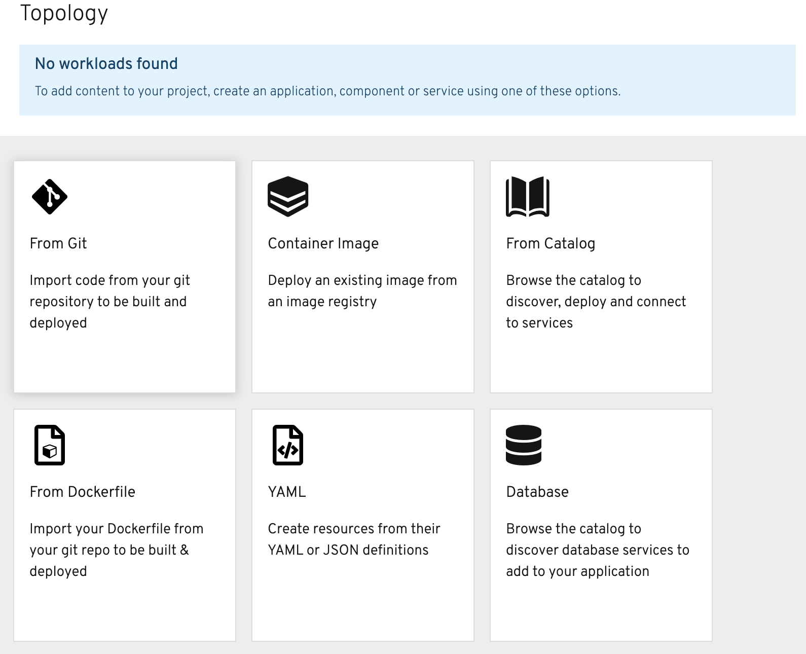
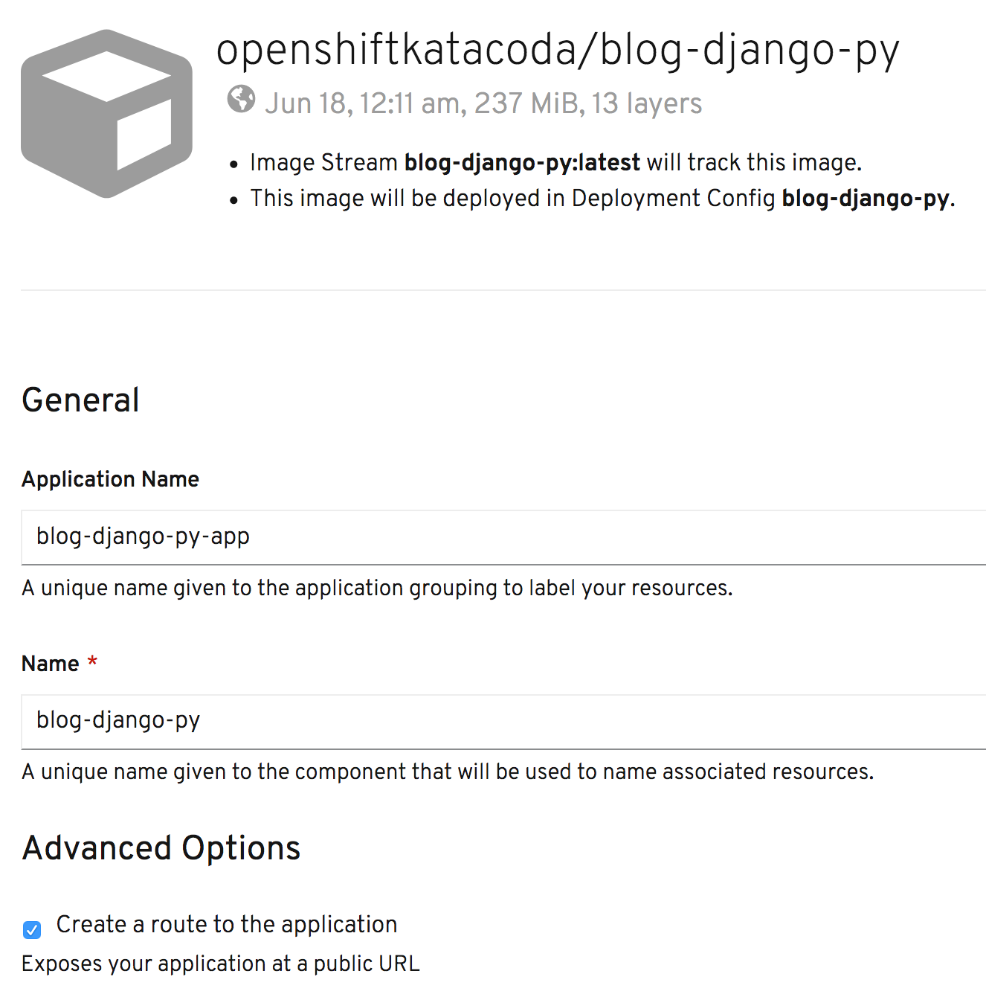
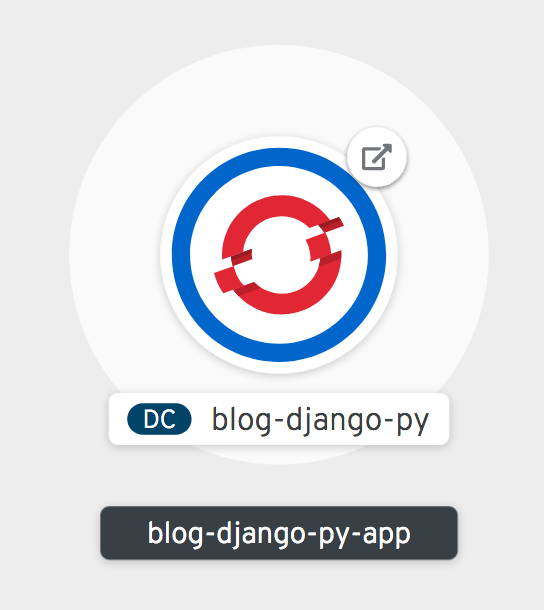
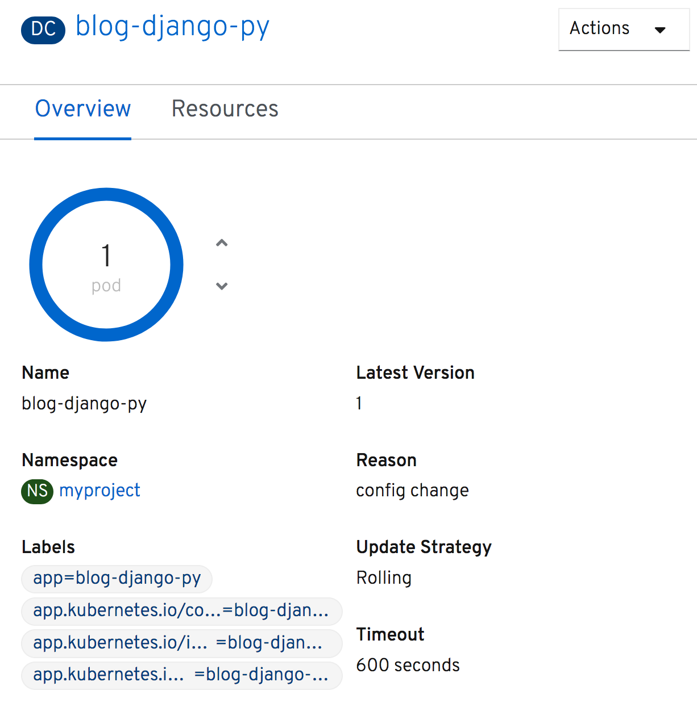
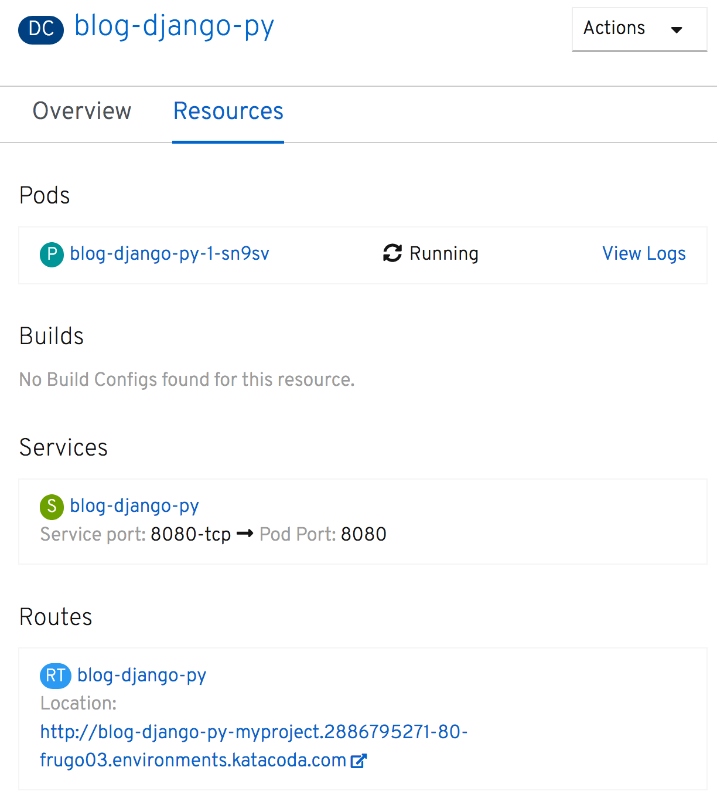
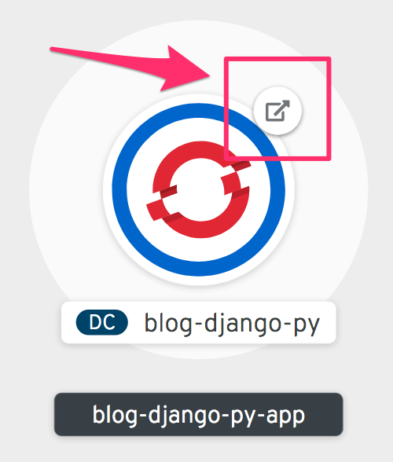

## Deploying a container image using the Web Console

The simplest way to deploy an application in OpenShift is to take an existing container image and run it. We are going to use the OpenShift web console to do this, so ensure you have the OpenShift web console open with the *Developer Perspective* active and that you are in the project called `lab-intro-{{ username }}`.

Switch to the OpenShift [Web Console]({{ console_url }}) and select the **Developer** perspective for the project instead of the **Adminstrator** perspective in the left hand side menu. 

On the **Topology** view, select **Container Image**. This should present the option of deploying an image by performing a search for the image on an image registry.



In the future, to get back to this menu of ways to add content to your project, you can click *+Add* in the left navigation.


For this example, the application image we are going to deploy is being hosted on the Docker Hub Registry.

In the **Image Name** field enter:

```copy
openshiftkatacoda/blog-django-py
```

Press **Enter**, or click on the magnifying glass to the right of the field. This should trigger a query to pull down the details of the image from the Docker Hub Registry, including information on when the image was last updated, the size of the image and the number of layers.



From the name of the image, the **Application Name** and deployment **Name** fields will be automatically populated.

The deployment name is used in OpenShift to identify the resources created when the application is deployed. This will include the internal **Service** name used by other applications in the same project to communicate with it, as well as being used as part of the default hostname for the application when exposed externally to the cluster via a **Route**.

The **Application Name** field is used to group multiple deployments together under the same name as part of one overall application.

In this example leave both fields as their default values. For your own application you would consider changing these to something more appropriate.

At the bottom of this page you will see that the checkbox for creating a route to the application is selected. This indicates that the application will be automatically given a public URL for accessing it. If you did not want the deployment to be accessible outside of the cluster, or it was not a web service, you would de-select the option.

When you are ready, at the bottom of the page click on _Create_. This will return you to the _Topology_ view, but this time you will see a representation of the deployment, rather than the options for deploying an application.



You may see the colour of the ring in the visualisation change from white, to light blue and then blue. This represents the phases of deployment as the container for the application starts up.

### Exploring the Topology View


To drill down and get further details on the deployment, click in the middle of the ring. This will result in a panel sliding out from the right hand side providing access to both an _Overview_:



and details on **Resources** related to the deployment.



From the **Overview** for the deployment, you can adjust the number of replicas, or pods, by clicking on the up and down arrows to the right of the ring.

The public URL for accessing the application can be found under _Resources_.

If you dismiss the panel, you can also access the application via its public URL, by clicking on the URL shortcut icon on the visualisation of the deployment.




## Deploying a container image using the CLI

Instead of deploying the existing container image from the [Web Console]({{ console_url }}), you can use the command line. Before we do that, lets delete the application we have already deployed.

Before we get started, be sure that you are in the right project

```execute
oc project lab-intro-{{ username }}
```


### Deleting the app deployed using the Web Console

To do this from the [Web Console]({{ console_url }}) you could visit each resource type created and delete them one at a time. The simpler way to delete an application is from the command line using the ``oc`` program.

To see a list of all the resources that have been created in the project so far, you can run the command:

```execute
oc get all -o name
```

This will display output similar to:

```
pod/blog-django-py-1-cbp96
pod/blog-django-py-1-deploy
replicationcontroller/blog-django-py-1
service/blog-django-py
deploymentconfig.apps.openshift.io/blog-django-py
imagestream.image.openshift.io/blog-django-py
route.route.openshift.io/blog-django-py
```

You have only created one application, so you would know that all the resources listed will relate to it. When you have multiple applications deployed, you need to identify those which are specific to the application you may want to delete. You can do this by applying a command to a subset of resources using a label selector.

To determine what labels may have been added to the resources, select one and display the details on it. To look at the _Route_ which was created, you can run the command:

```execute
oc describe route/blog-django-py
```

This should display output similar to:

```
Name:                   blog-django-py
Namespace:              myproject
Created:                2 minutes ago
Labels:                 app=blog-django-py
                        app.kubernetes.io/component=blog-django-py
                        app.kubernetes.io/instance=blog-django-py
                        app.kubernetes.io/part-of=blog-django-py-app
Annotations:            openshift.io/generated-by=OpenShiftWebConsole
                        openshift.io/host.generated=true
Requested Host:         blog-django-py-myproject.2886795274-80-frugo03.environments.katacoda.com
                          exposed on router default (host apps-crc.testing) 2 minutes ago
Path:                   <none>
TLS Termination:        <none>
Insecure Policy:        <none>
Endpoint Port:          8080-tcp

Service:        blog-django-py
Weight:         100 (100%)
Endpoints:      10.128.0.205:8080
```

In this case when deploying the existing container image via the OpenShift [Web Console]({{ console_url }}), OpenShift has applied automatically to all resources the label ``app=blog-django-py``. You can confirm this by running the command:

```execute
oc get all --selector app=blog-django-py -o name
```

This should display the same list of resources as when ``oc get all -o name`` was run. To double check that this is doing what is being described, run instead:

```execute
oc get all --selector app=blog -o name
```

In this case, because there are no resources with the label ``app=blog``, the result will be empty.

Having a way of selecting just the resources for the one application, you can now schedule them for deletion by running the command:

```execute
oc delete all --selector app=blog-django-py
```

To confirm that the resources have been deleted, run again the command:

```execute
oc get all -o name
```

If you do still see any resources listed, keep running this command until it shows they have all been deleted. You can find that resources may not be deleted immediately as you only scheduled them for deletion and how quickly they can be deleted will depend on how quickly the application can be shutdown.

Although label selectors can be used to qualify what resources are to be queried, or deleted, do be aware that it may not always be the ``app`` label that you need to use. When an application is created from a template, the labels applied and their names are dictated by the template. As a result, a template may use a different labelling convention. Always use ``oc describe`` to verify what labels have been applied and use ``oc get all --selector`` to verify what resources are matched before deleting any resources.


### Deploying the app using the CLI

You now have a clean project again, so lets deploy the same existing container image, but this time using the ``oc`` command line program.

The name of the image you used previously was:

```
openshiftkatacoda/blog-django-py
```

If you have been given the name of an image to deploy and want to verify that it is valid from the command line, you can use the ``oc new-app --search`` command. For this image run:

```execute
oc new-app --search openshiftkatacoda/blog-django-py
```

This should display output similar to:

```
Docker images (oc new-app --docker-image=<docker-image> [--code=<source>])
-----
openshiftkatacoda/blog-django-py
  Registry: Docker Hub
  Tags:     latest
```

It confirms that the image is found on the Docker Hub Registry.

To deploy the image, you can run the command:

```execute
oc new-app openshiftkatacoda/blog-django-py
```

This will display out similar to:

```
--> Found container image 927f823 (4 months old) from Docker Hub for "openshiftkatacoda/blog-django-py"

    Python 3.5
    ----------
    Python 3.5 available as container is a base platform for building and running various Python 3.5 applications and frameworks. Python is an easy to learn, powerful programming language. It has efficient high-level data structures and a simple but effective approach to object-oriented programming. Python's elegant syntax and dynamic typing, together with its interpreted nature, make it an ideal language for scripting and rapid application development in many areas on most platforms.

    Tags: builder, python, python35, python-35, rh-python35

    * An image stream tag will be created as "blog-django-py:latest" that will track this image
    * This image will be deployed in deployment config "blog-django-py"
    * Port 8080/tcp will be load balanced by service "blog-django-py"
      * Other containers can access this service through the hostname "blog-django-py"

--> Creating resources ...
    imagestream.image.openshift.io "blog-django-py" created
    deploymentconfig.apps.openshift.io "blog-django-py" created
    service "blog-django-py" created
--> Success
    Application is not exposed. You can expose services to the outside world by executing one or more of the commands below:
     'oc expose svc/blog-django-py'
    Run 'oc status' to view your app.
```

OpenShift will assign a default name based on the name of the image, in this case ``blog-django-py``. You can specify a different name to be given to the application, and the resources created, by supplying the ``--name`` option along with the name you wish to use as an argument.

Unlike how it is possible when deploying an existing container image from the [Web Console]({{ console_url }}), the application is not exposed outside of the OpenShift cluster by default. To expose the application created so it is available outside of the OpenShift cluster, you can run the command:

```execute
oc expose service/blog-django-py
```

Switch to the OpenShift [Web Console]({{ console_url }}) by selecting on **Console** to verify that the application has been deployed. Select on the URL shortcut icon displayed for the application on the **Topology** view for the project to visit the application.

Alternatively, to view the hostname assigned to the route created from the command line, you can run the command:

```execute
oc get route/blog-django-py
```

