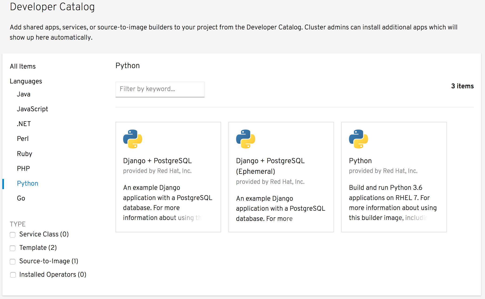
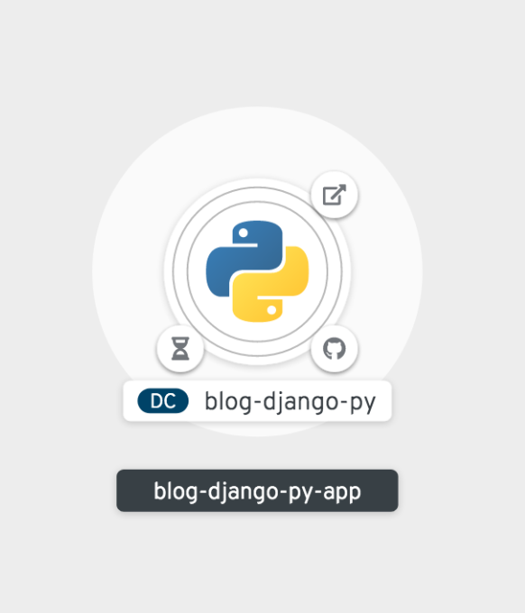
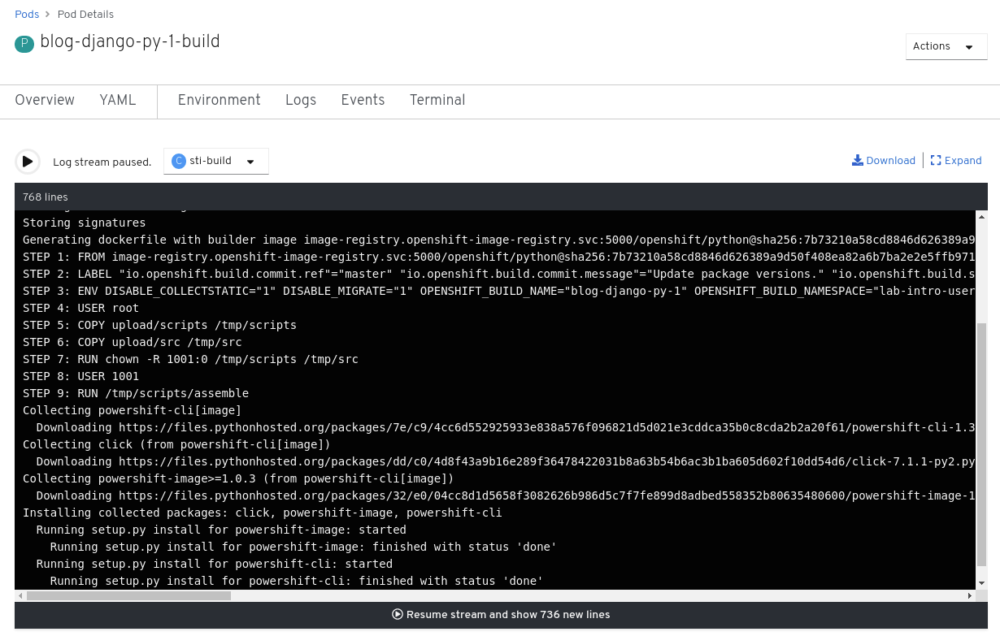
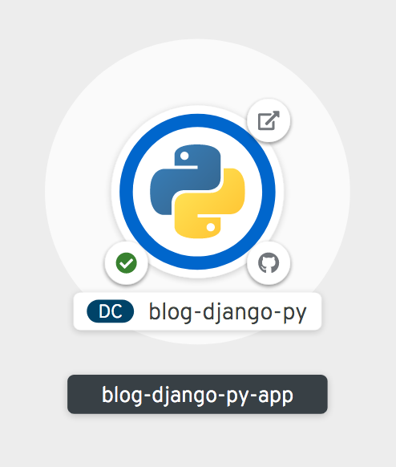

Before we get started, be sure that you are in the right project in the CLI:

```execute
oc project lab-intro-{{ username }}
```

Let's remove all created objects during the previous steps:

```execute
oc delete all --all
```

## Background: Source-to-Image (S2I)

In a previous section, you learned how to deploy an application from a pre-existing container image. Here you will learn how to deploy an application direct from source code hosted in a remote Git repository. This will be done using the [Source-to-Image (S2I)](https://github.com/openshift/source-to-image) tool.

The documentation for S2I describes itself in the following way:

> Source-to-image (S2I) is a tool for building reproducible container images. S2I
produces ready-to-run images by injecting source code into a container image and
assembling a new container image which incorporates the builder image and built
source. The result is then ready to use with docker run. S2I supports
incremental builds which re-use previously downloaded dependencies, previously
built artifacts, etc.

OpenShift is S2I-enabled and can use S2I as one of its build mechanisms (in addition to building container images from Dockerfiles and "custom" builds).

A full discussion of S2I is beyond the scope of this tutorial. More information about S2I can be found in the [OpenShift S2I documentation](https://docs.openshift.org/latest/creating_images/s2i.html) and the [GitHub project respository for S2I](https://github.com/openshift/source-to-image).

The only key concept you need to remember about S2I is that it handles the process of building your application container image for you from your source code.


## Deploy an APP from source using the Web Console

Switch to the OpenShift [Web Console]({{ console_url }}). From the options presented for deploying an application, select **From Catalog**. This will land you on the **Developer Catalog**.


In this course you are going to deploy a web application which is implemented using the Python programming language.

Click on **Languages** on the left hand side and then select **Python**. Any options for deploying applications which are related to Python will be displayed.



Click on the **Python** tile for the generic Python Source-to-Image (S2I) builder. This will bring up a dialog with the details of the builder image. Click on **Create Application** in the dialog.


Under the **Git** settings, in the **Git Repo URL** enter:

```copy
https://github.com/openshift-katacoda/blog-django-py
```

Scroll down to the **General** settings and click on the **Application Name** field.


When you click on the **Application Name** field, the settings in this section should be pre-populated with values based on the Git repository name. Leave the settings with their default values.

When you are ready, at the bottom of the page click on **Create**. This will create resources to manage the build and deployment of the application. You will then be redirected to the topology overview for the project.



The topology overview provides a visual representation of the application you have deployed.

The Git icon shown to the lower right of the ring can be clicked on to take you to the hosted Git repository from which the source code for the application was built.

The icon shown to the lower left represents the build of the application. The icon will change from showing an hour glass, indicating the build is starting, to a sync icon indicating the build is in progress, and finally to a tick or cross depending on whether the build was successful or failed. Clicking on this icon will take you to the details of the current build.

This is the step where S2I is run on the application source code from the Git repository to create the image which will then be run. Once the build has started, click on the **View Logs** link shown on the **Resources** panel.



This will allow you to monitor the progress of the build as it runs. The build will have completely successfully when you see a final message of "Push successful". This indicates that the container image for the application was pushed to the OpenShift internal image registry.

Head back to *Topology view* when the build completes to see the image being deployed and the application being started up. The build is complete when you see the following in the build logs: `Push successful`.

The ring itself will progress from being white, indicating the deployment is pending, to light blue indicating the deployment is starting, and blue to indicate the application is running. The ring can also turn dark blue if the application is stopping.


Clicking anywhere on the area enclosed by the ring will bring up a panel giving details of the resources for the application, and access to a general overview of the deployment.


Once the application is running, the icon shown to the upper right can be clicked to open the URL for the application route which was created. Click on **Topology** in the left hand menu bar to return to the topology view for the project.



When you created the application using the web console, a **Route** was automatically created for the application and it will be exposed outside of the cluster. The URL which can be used to access the application from a web browser was visible on the **Resources** tab for the application you viewed previously.


From the topology view, you can quickly get to the URL for the deployed application by clicking on the icon top right of the ring in the visualisation for the application.

Wait for the ring to turn from light blue to blue to indicate the deployment is complete. Now click on the icon and you should see the blog application you deployed.


## Deploy an APP from source using CLI

### Delete the already created APP

Instead of deploying the application from the web console, you can use the command line. Before we do that, lets delete the application we have already deployed.

To do this from the web console you could visit each resource type created and delete them one at a time. The simpler way to delete an application is from the command line using the ``oc`` program.

To see a list of all the resources that have been created in the project so far, you can run the command:

```execute
oc get all -o name
```

This will display output similar to:

```
pod/blog-django-py-1-9vbmf
pod/blog-django-py-1-build
pod/blog-django-py-1-deploy
replicationcontroller/blog-django-py-1
service/blog-django-py
deploymentconfig.apps.openshift.io/blog-django-py
buildconfig.build.openshift.io/blog-django-py
build.build.openshift.io/blog-django-py-1
imagestream.image.openshift.io/blog-django-py
route.route.openshift.io/blog-django-py
```

You have only created one application, so you would know that all the resources listed will relate to it. When you have multiple applications deployed, you need to identify those which are specific to the application you may want to delete. You can do this by applying a command to a subset of resources using a label selector.

To determine what labels may have been added to the resources, select one and display the details on it. To look at the **Route** which was created, you can run the command:

```execute
oc describe route/blog-django-py
```

This should display output similar to:

```
Name:                   blog-django-py
Namespace:              myproject
Created:                9 minutes ago
Labels:                 app=blog-django-py
                        app.kubernetes.io/component=blog-django-py
                        app.kubernetes.io/instance=blog-django-py
                        app.kubernetes.io/name=python
                        app.kubernetes.io/part-of=blog-django-py-app
                        app.openshift.io/runtime=python
                        app.openshift.io/runtime-version=3.6
Annotations:            app.openshift.io/vcs-ref=master
                        app.openshift.io/vcs-uri=https://github.com/openshift-katacoda/blog-django-py
                        openshift.io/host.generated=true
Requested Host:         blog-django-py-myproject.2886795274-80-frugo03.environments.katacoda.com
                          exposed on router default (host apps-crc.testing) 9 minutes ago
Path:                   <none>
TLS Termination:        <none>
Insecure Policy:        <none>
Endpoint Port:          8080-tcp

Service:        blog-django-py
Weight:         100 (100%)
Endpoints:      10.128.0.206:8080
```

In this case when deploying the application via the OpenShift web console, OpenShift has applied automatically to all resources the label ``app=blog-django-py``. You can confirm this by running the command:

```execute
oc get all --selector app=blog-django-py -o name
```

This should display the same list of resources as when ``oc get all -o name`` was run. To double check that this is doing what is being described, run instead:

```execute
oc get all --selector app=blog -o name
```

In this case, because there are no resources with the label ``app=blog``, the result will be empty.

Having a way of selecting just the resources for the one application, you can now schedule them for deletion by running the command:

```execute
oc delete all --selector app=blog-django-py
```

To confirm that the resources have been deleted, run again the command:

```execute
oc get all -o name
```

If you do still see any resources listed, keep running this command until it shows they have all been deleted. You can find that resources may not be deleted immediately as you only scheduled them for deletion and how quickly they can be deleted will depend on how quickly the application can be shutdown.

Although label selectors can be used to qualify what resources are to be queried, or deleted, do be aware that it may not always be the ``app`` label that you need to use. When an application is created from a template, the labels applied and their names are dictated by the template. As a result, a template may use a different labelling convention. Always use ``oc describe`` to verify what labels have been applied and use ``oc get all --selector`` to verify what resources are matched before deleting any resources.

### Start the deployment from CLI

You now have a clean project again, so lets deploy the same web application, but this time using the ``oc`` command line program.

The URL of the Git repository containing the web application is:

`https://github.com/openshift-katacoda/blog-django-py`

We want to deploy it using the S2I builder for the latest version of Python provided by the platform. To do this run the command:

```execute
oc new-app python:latest~https://github.com/openshift-katacoda/blog-django-py
```

This should display output similar to:

```
--> Found image 2437334 (6 weeks old) in image stream "openshift/python" under tag "latest" for "python:latest"

    Python 3.6
    ----------
    ...

    Tags: builder, python, python36, python-36, rh-python36

    * A source build using source code from https://github.com/openshift-katacoda/blog-django-py will be created
      * The resulting image will be pushed to image stream tag "blog-django-py:latest"
      * Use 'oc start-build' to trigger a new build
    * This image will be deployed in deployment config "blog-django-py"
    * Port 8080/tcp will be load balanced by service "blog-django-py"
      * Other containers can access this service through the hostname "blog-django-py"

--> Creating resources ...
    imagestream.image.openshift.io "blog-django-py" created
    buildconfig.build.openshift.io "blog-django-py" created
    deploymentconfig.apps.openshift.io "blog-django-py" created
    service "blog-django-py" created
--> Success
    Build scheduled, use 'oc logs -f bc/blog-django-py' to track its progress.
    Application is not exposed. You can expose services to the outside world by executing one or more of the commands below:
     'oc expose svc/blog-django-py'
    Run 'oc status' to view your app.
```

OpenShift will assign a default name for the application created based on the name of the Git repository. In this case that is ``blog-django-py``. If you wanted to change the name, you could have supplied the ``--name`` option along with the name you wish to use as an argument.

To monitor the log output from the build as it is running, run the command:

```execute
oc logs bc/blog-django-py --follow
```

This command will exit once the build has completed. You can also interrupt the command by typing **CTRL-C** in the terminal window.

To view the status of any applications deployed to the project you can run the command:

```execute
oc status
```

Once the build and deployment of the application has completed you should see output similar to:

```
In project myproject on server https://openshift:6443

svc/blog-django-py - 172.30.54.158:8080
  dc/blog-django-py deploys istag/blog-django-py:latest <-
    bc/blog-django-py source builds https://github.com/openshift-katacoda/blog-django-py on openshift/python:latest
    deployment #1 pending 10 seconds ago - 0/1 pods


3 infos identified, use 'oc status --suggest' to see details.
```

Unlike the case of deploying the application from the web console, the application is not exposed outside of the OpenShift cluster by default. To expose the application so it is available outside of the OpenShift cluster, you can run the command:

```execute
oc expose service/blog-django-py
```

Switch to the OpenShift web console by selecting on **Console** to verify that the application has been deployed.

You will note though that the visualisation on the topology view lacks icons for the build and source code repository. This is because they rely on special annotations and labels added to the deployment when creating an application from the web console. These annotations are not added automatically when creating the application from the command line. You can add the annotations later if you wanted.

The icon for accessing the URL is still present on the visualisation. Alternatively, to view the hostname assigned to the route created from the command line, you can run the command:

```execute
oc get route/blog-django-py
```

## Triggering a new build

The source code for an application isn't going to be static, so a way to trigger a new build after making any changes is required.

To do this from the command line using ``oc``, run the command:

```execute
oc start-build blog-django-py
```

This should display:

```
build.build.openshift.io/blog-django-py-2 started
```

A new build could also have been triggered from the web console by finding the build configuration for the application under the **Builds** menu, selecting the kebab menu on the right side of the entry, and clicking on **Start Build**.

As before you can use ``oc logs`` to monitor the log output as the build runs. You can also monitor the progress of any builds in a project by running the command:

```execute
oc get builds --watch
```

As the build progresses, this should display output similar to:

```
NAME                TYPE      FROM          STATUS     STARTED         DURATION
blog-django-py-1    Source    Git@fcdc38c   Complete   2 minutes ago   1m2s
blog-django-py-2    Source    Git@fcdc38c   Running    3 seconds ago   3s
blog-django-py-2    Source    Git@fcdc38c   Complete   About a minute ago   1m9s
```

To exit the command type **CTRL-C** in the terminal window.

To display information about the build configuration for the application you can run:

```execute
oc describe bc/blog-django-py
```

This will display output similar to:

```
Name:           blog-django-py
Namespace:      myproject
Created:        8 minutes ago
Labels:         app=blog-django-py
Annotations:    openshift.io/generated-by=OpenShiftNewApp
Latest Version: 2

Strategy:       Source
URL:            https://github.com/openshift-katacoda/blog-django-py
From Image:     ImageStreamTag openshift/python:latest
Output to:      ImageStreamTag blog-django-py:latest

Build Run Policy:       Serial
Triggered by:           Config, ImageChange
Webhook GitHub:
        URL:    https://openshift:6443/apis/build.openshift.io/v1/namespaces/myproject/buildconfigs/blog-django-py/webhooks/<secret>/github
Webhook Generic:
        URL:            https://openshift:6443/apis/build.openshift.io/v1/namespaces/myproject/buildconfigs/blog-django-py/webhooks/<secret>/generic
        AllowEnv:       false
Builds History Limit:
        Successful:     5
        Failed:         5

Build                   Status          Duration        Creation Time
blog-django-py-2        complete        1m28s           2019-11-05 05:19:32 +0000 UTC
blog-django-py-1        complete        1m31s           2019-11-05 05:13:21 +0000 UTC

Events: <none>
```

You can see details of the Git repository being used as the source for any build.

You will also see listed webhook URLs that can be configured into a Git hosting service to trigger a new build automatically when changes are committed and pushed up to a Git repository. As you are using a Git repository on GitHub that you don't own this can not be done for this exercise, but if you had forked the Git repository into your own account, or this was your own application, it could have been configured.

The typical workflow followed when developing an application, is to work on your application source code on your own local machine. When you are happy with changes and they are ready to be made live, commit the changes and push them up to the hosted Git repository linked to the build configuration. If a webhook has been configured, a new build and deployment would be triggered automatically, otherwise you can trigger a new build manually.

In the case of where you are rapidly iterating on changes to test ideas and don't want to have to commit every change and push it back up to the hosted Git repository, you can use what is called a binary input build.

To demonstrate this, clone the Git repository for the application by running:

```execute
cd ~
git clone https://github.com/openshift-katacoda/blog-django-py
```

This will create a sub directory ``blog-django-py`` containing the source code for the application:

```
Cloning into 'blog-django-py'...
remote: Enumerating objects: 3, done.
remote: Counting objects: 100% (3/3), done.
remote: Compressing objects: 100% (3/3), done.
remote: Total 412 (delta 0), reused 0 (delta 0), pack-reused 409
Receiving objects: 100% (412/412), 68.49 KiB | 556.00 KiB/s, done.
Resolving deltas: 100% (200/200), done.
```

Change into the sub directory.

```execute
cd blog-django-py
```

To show how a build can be triggered from the local copy of the application source code, without needing to commit changes back to the Git repository, first run the command:

```execute
echo 'BLOG_BANNER_COLOR=blue' >> .s2i/environment
```

This command will update an environment variable setting file used by S2I to determine what environment variables are baked into the application image created.

Start a new build by running the command:

```execute
oc start-build blog-django-py --from-dir=. --wait
```

This is similar to what you ran before, with the exception that the option ``--from-dir=.`` is also passed to the command, indicating that source code should be uploaded from the directory on the host where you are running the command, rather than it being pulled down from the hosted Git repository.

The output from running the command should start with:

```
Uploading directory "." as binary input for the build ...
```

indicating that the source code is being uploaded.

The ``--wait`` option is also supplied to indicate that the command should only return when the build has completed. This option can be useful if integrating it into a script and you need to ensure the build has completed before running a subsequent command.

While the build command is running and the application is being deployed, switch to the web console to monitor progress. You can find the details for the current build by selecting **Builds** from the left hand side menu, selecting on the build configuration for ``blog-django-py``, selecting the **Builds** tab and then clicking on ``blog-django-py-3``.

Once the build and deployment is finished, if you visit the web application once more, you will see that the banner colour has been changed to blue.


When you use the ``--from-dir=.`` option with ``oc start-build``, the contents from the current working directory will only be used for that one build. If you wanted to run further builds with source code from your local directory, you would need to supply ``--from-dir=.`` each time.

To return back to using the source code from the hosted Git repository, run:


```execute
oc start-build blog-django-py
```

This should output:

```
build.build.openshift.io/blog-django-py-4 started
```

If for some reason a build was wrongly started, or you realised it would fail anyway, you can cancel the build by running ``oc cancel-build`` and supplying the name of the build.

```execute
oc cancel-build blog-django-py-4
```

This should show the build has been cancelled.

```
build.build.openshift.io/blog-django-py-4 marked for cancellation, waiting to be cancelled
build.build.openshift.io/blog-django-py-4 cancelled
```

You can confirm this by also looking at the list of all builds run.

```execute
oc get builds
```

This should display output similar to:

```
NAME               TYPE     FROM             STATUS                       STARTED          DURATION
blog-django-py-1   Source   Git@35b89e2      Complete                     15 minutes ago   1m31s
blog-django-py-2   Source   Git@35b89e2      Complete                     8 minutes ago    1m28s
blog-django-py-3   Source   Binary@35b89e2   Complete                     3 minutes ago    1m28s
blog-django-py-4   Source   Git@35b89e2      Cancelled (CancelledBuild)   31 seconds ago   23s
```

Note that starting a build using source code from a local directory on your own machine can only be done from the command line. There is no way to trigger such a build from the web console.


